# 00 — Arquitectura de SAP BTP y entorno Cloud Foundry

**Estado:** 🟨 En curso
**Duración estimada:** 45–60 minutos
**Entorno:** SAP BTP Trial — subcuenta `trial`

## Objetivo

Comprender la organización de SAP BTP, el papel de Cloud Foundry y la diferencia entre una suscripción de Integration Suite, una instancia de servicio, una service key y el runtime gestionado de Cloud Integration.

## Prerrequisitos

- Acceso a SAP BTP Trial.
- Subcuenta `trial` y Cloud Foundry habilitados.
- Suscripción a SAP Integration Suite y acceso a Cloud Integration.
- No se necesitan credenciales ni service keys para documentar este laboratorio.

## Conceptos fundamentales

- **IaaS:** infraestructura de cómputo, red y almacenamiento suministrada por un proveedor cloud.
- **PaaS:** plataforma que abstrae gran parte de la administración de infraestructura y permite desarrollar, desplegar o consumir servicios.
- **SaaS:** aplicaciones consumidas como servicio.
- **Global Account:** nivel superior de administración de SAP BTP.
- **Subaccount:** ámbito de administración de servicios, suscripciones, configuraciones y autorizaciones.
- **Cloud Foundry Organization:** ámbito organizativo de Cloud Foundry asociado al entorno.
- **Space:** área de Cloud Foundry para aplicaciones e instancias de servicios.
- **Entitlement:** derecho de uso de un servicio o plan asignado según el modelo de SAP BTP.
- **Subscription:** suscripción a una aplicación, como Integration Suite.
- **Service Instance:** recurso aprovisionado de un servicio y plan determinados.
- **Service Key:** información de acceso y posibles credenciales asociadas a una instancia.
- **Cloud Integration Runtime:** servicio gestionado por SAP que ejecuta la lógica de los iFlows.

> Importante: la instancia `SAP Process Integration Runtime` del plan `integration-flow` no equivale al motor de ejecución de los iFlows instalado como aplicación dentro del space `dev`.

## Arquitectura lógica observada

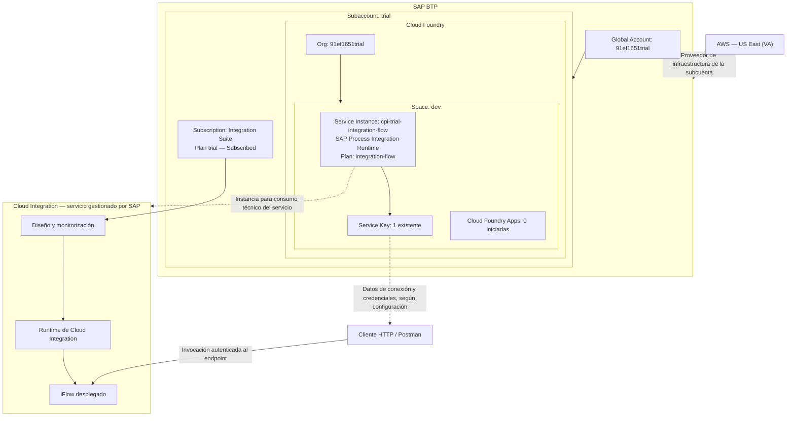

**Alcance del diagrama:** relaciones lógicas, no ubicación física ni topología interna de SAP. La instancia de servicio no ejecuta por sí misma los iFlows. La existencia de una key no demuestra que se haya utilizado para una prueba específica.

## Entorno observado en el laboratorio

| Elemento | Evidencia observada |
|---|---|
| Global Account | `91ef1651trial` |
| Subaccount | `trial` |
| Proveedor | Amazon Web Services (AWS) |
| Región | US East (VA) — AWS |
| Entorno | Multi-Environment |
| Cloud Foundry Org | `91ef1651trial` |
| Space | `dev` |
| Aplicaciones Cloud Foundry iniciadas | 0 |
| Instancias de servicio en `dev` | 1 |
| Suscripción Integration Suite | `Subscribed`, plan `trial` |
| Otra suscripción | SAP Business Application Studio, plan `trial` |
| Service Instance | `cpi-trial-integration-flow` |
| Servicio / plan | SAP Process Integration Runtime / `integration-flow` |
| Estado de creación | `Creation Succeeded` |
| Service Keys | 1 (contenido no inspeccionado) |
| Package en Design | `CPI Learning Lab`, versión `1.0.0` |
| Monitor — artefactos | 1 iniciado, 0 en error en la captura |
| Monitor — última hora | 0 mensajes mostrados en la captura |

**Limitaciones:** las capturas no prueban la topología física del runtime ni identifican las credenciales utilizadas en el laboratorio 03. El contador de mensajes de la última hora no representa el historial completo.

## Laboratorio 00.1 — Identificar la estructura de BTP

1. Entrar a SAP BTP Cockpit y abrir **Account Explorer**.
   **Por qué:** identificar el nivel superior de administración.

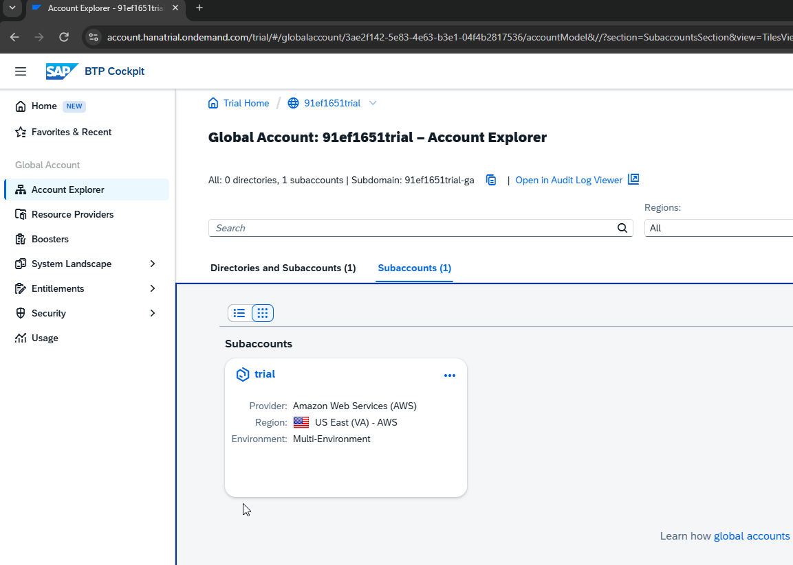

*Figura — Account Explorer: Global Account y subcuenta trial.*

2. Abrir la subcuenta `trial` y consultar **Overview**.
   **Por qué:** confirmar proveedor, región y entorno.

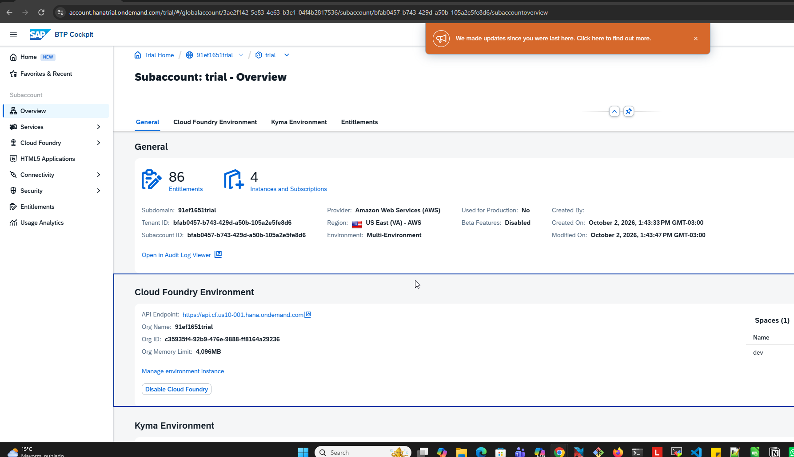

*Figura — Subaccount Overview: proveedor, región y Cloud Foundry.*

3. Ir a **Cloud Foundry → Spaces** y abrir `dev`.
   **Por qué:** distinguir recursos de Cloud Foundry de los servicios gestionados.

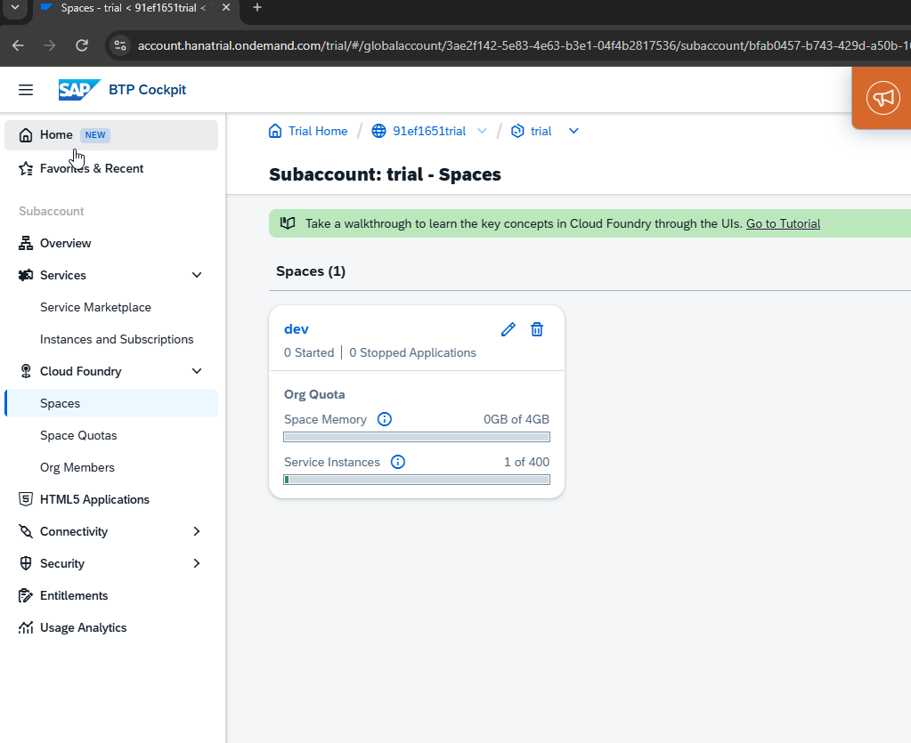

*Figura — Space dev: aplicaciones iniciadas e instancias de servicio.*

4. Verificar aplicaciones e instancias mostradas.
   **Resultado esperado:** el espacio muestra sus propios contadores, que no son los contadores de artefactos de Cloud Integration.

**Validación:** confirmación del estudiante y capturas de Account Explorer, Overview y Spaces.
**Resultado:** validado durante la conversación.

## Laboratorio 00.2 — Suscripciones e instancias

1. En la subcuenta, abrir **Services → Instances and Subscriptions**.
   **Por qué:** observar separadamente suscripciones, instancias y entornos.

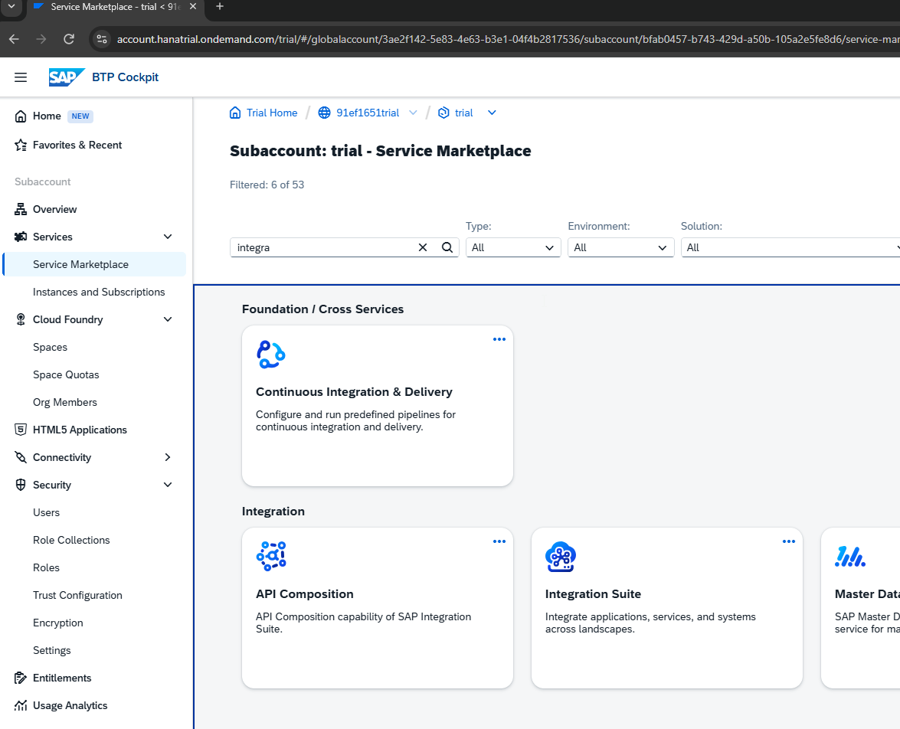

*Figura — Service Marketplace: catálogo de servicios, no prueba de suscripción.*

2. Identificar **Integration Suite**, plan `trial`, y verificar estado `Subscribed`.
   **Por qué:** confirmar que la aplicación está suscrita.

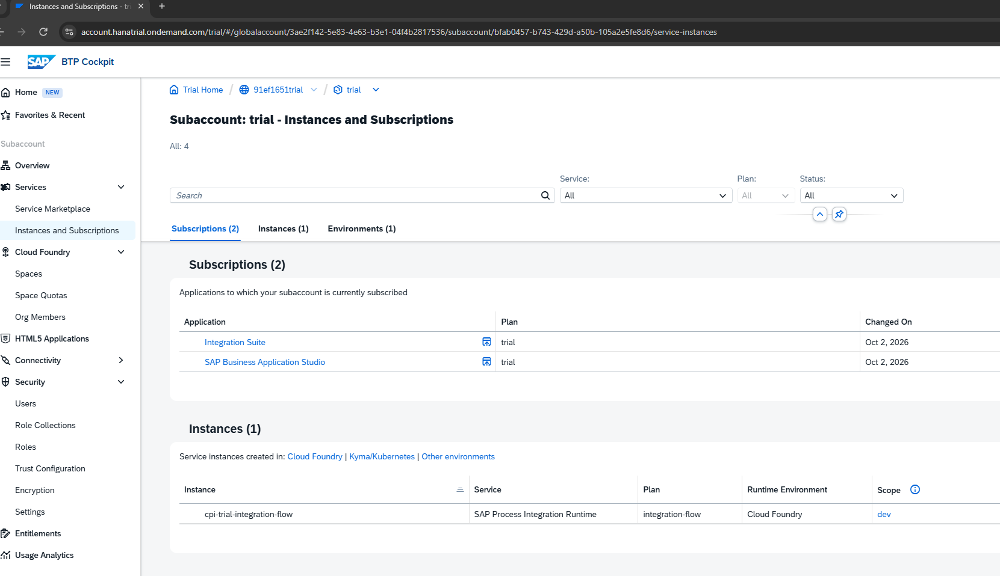

*Figura — Instances and Subscriptions: suscripciones e instancia.*

3. Identificar `cpi-trial-integration-flow`, servicio **SAP Process Integration Runtime**, plan `integration-flow`.
   **Por qué:** distinguir una instancia de servicio de una suscripción.

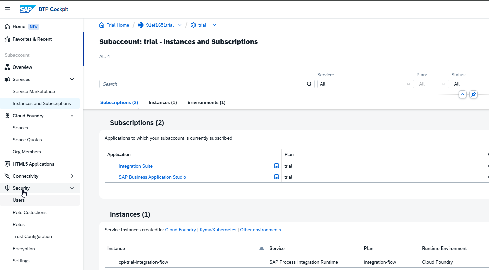

*Figura — Detalle de suscripciones e instancia de SAP Process Integration Runtime.*

4. Abrir **Cloud Foundry → Spaces → dev → Services → Instances**.
   **Por qué:** comprobar en qué space se administra la instancia.
5. Verificar `Creation Succeeded` y el indicador `1 key`, **sin abrir ni copiar la key**.
   **Por qué:** documentar aprovisionamiento y existencia de credenciales sin exponer secretos.

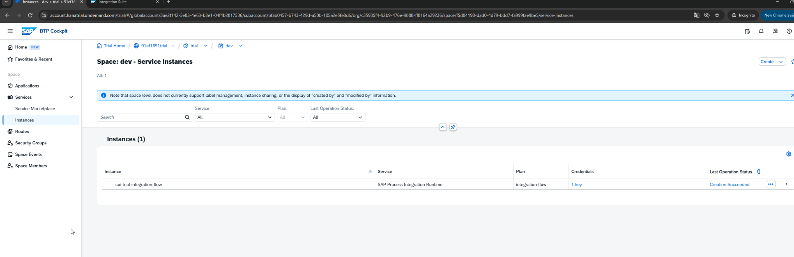

*Figura — Vista del space dev: creación exitosa y una service key, sin revelar su contenido.*

**Resultado esperado:** dos suscripciones, una instancia de servicio y un entorno, según las capturas.
**Validación:** capturas del cockpit; resultado observado conforme a lo esperado.

## Laboratorio 00.3 — Acceso a Cloud Integration

1. Abrir **Integration Suite → Go to Application**.
   **Por qué:** comprobar el acceso a la aplicación suscrita.

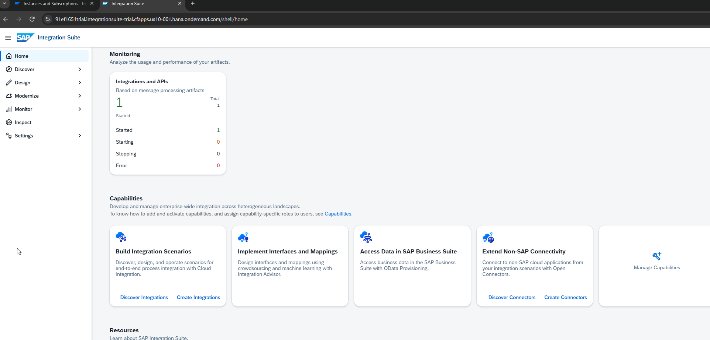

*Figura — Integration Suite Home: acceso a capacidades y artefacto iniciado.*

2. Entrar a **Design → Integrations and APIs** y ubicar `CPI Learning Lab`.
   **Por qué:** diferenciar contenido de diseño de recursos de Cloud Foundry.

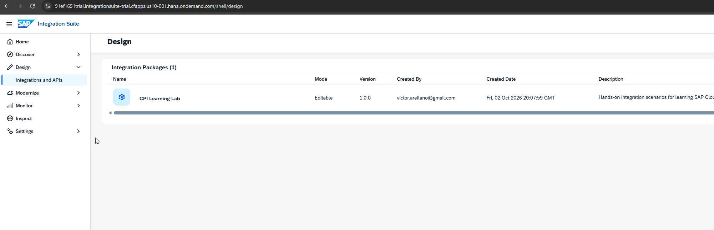

*Figura — Design: paquete CPI Learning Lab.*

3. Entrar a **Monitor → Integrations and APIs**.
   **Por qué:** comprobar el estado de los artefactos gestionados por Cloud Integration.

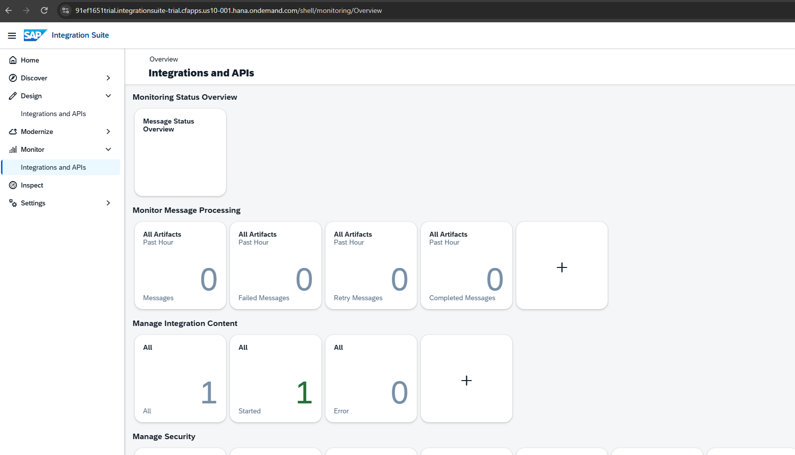

*Figura — Monitor: un artefacto iniciado y cero mensajes en la última hora.*

4. Comparar `1 Started` en Monitor con `0 Started Applications` en Cloud Foundry.
   **Por qué:** validar que ambas pantallas contabilizan tipos de recursos diferentes.

**Resultado observado:** un paquete editable y un artefacto iniciado en Monitor.
**Validación:** capturas compartidas; acceso y distinción de recursos verificados.

## Validación conceptual

**Pregunta:** Si `dev` tiene cero aplicaciones iniciadas, pero Cloud Integration muestra un artefacto iniciado, ¿significa que existe un error?

**Respuesta:** No. El contador del space refleja aplicaciones Cloud Foundry de ese espacio; el artefacto de Cloud Integration se ejecuta en un runtime gestionado por SAP, no como una aplicación ordinaria del space `dev`.

**Matiz:** la instancia `cpi-trial-integration-flow` está aprovisionada en `dev`, pero no es el proceso que ejecuta físicamente el iFlow. Su service key contiene datos técnicos de acceso según el servicio y su configuración.

## Problemas encontrados y aclaraciones

- **Confusión terminológica:** el nombre *SAP Process Integration Runtime* puede sugerir que su service instance es el propio motor que ejecuta los iFlows. No debe interpretarse así.
- **Contadores aparentemente contradictorios:** cero aplicaciones en `dev` y un artefacto iniciado en Cloud Integration son compatibles.
- **Evidencia insuficiente sobre OAuth:** se observa una service key, pero no se verificó su contenido ni su uso específico en el tema 03.
- **Seguridad documental:** no guardar service keys completas, `client_secret`, tokens, contraseñas ni capturas con secretos. Si alguna credencial queda expuesta, rotarla.

Estos hallazgos pueden incorporarse a `docs/kba-y-hallazgos.md` como aclaraciones reutilizables, sin atribuir fallos al runtime.

## Aprendizajes

1. La subcuenta es un ámbito de administración de SAP BTP; el space pertenece al entorno Cloud Foundry.
2. Entitlement, subscription, service instance y service key no son equivalentes.
3. Una service instance no implica que el motor de Cloud Integration esté desplegado dentro de ese space.
4. Design y Monitor muestran artefactos y mensajes de Cloud Integration, no aplicaciones Cloud Foundry.
5. Las capturas permiten validar recursos visibles, pero no la infraestructura interna gestionada por SAP.

## Referencias

- SAP Help Portal — SAP Business Technology Platform: https://help.sap.com/docs/btp
- SAP Help Portal — SAP Integration Suite: https://help.sap.com/docs/integration-suite
- SAP Discovery Center: https://discovery-center.cloud.sap/

Consultar las guías vigentes de SAP para detalles específicos de servicios, planes y autenticación.

## Uso de las imágenes en GitHub

Las imágenes se almacenan en `images/tema-00/` y el documento en `docs/`. Mantener la estructura al subir al repositorio; las rutas relativas permiten ver las capturas en GitHub. Antes de publicar, revisar cualquier dato personal o identificador que aparezca en capturas. No se incluyen service keys ni secretos.
