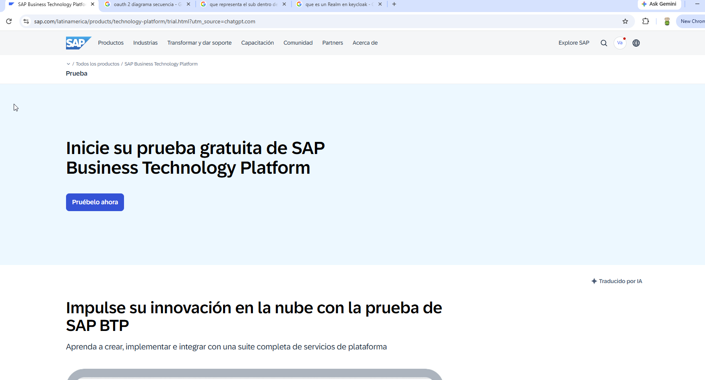
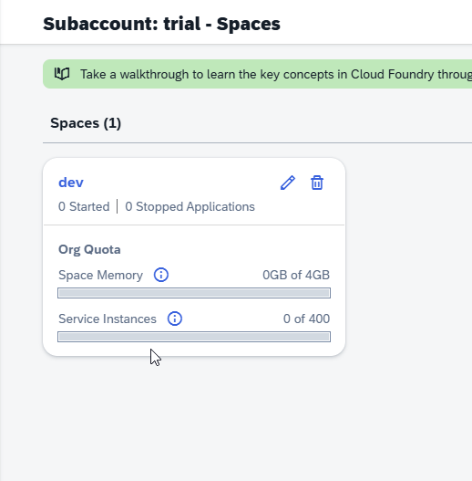

# 01 --- Habilitación de SAP BTP Trial

**Estado:** ✅ Completado

## Objetivo

Disponer de un entorno SAP BTP Trial funcional sobre el cual habilitar
posteriormente SAP Integration Suite.

## Conceptos revisados

Se revisaron los conceptos de Global Account, Subaccount, región,
proveedor cloud, Cloud Foundry Organization y Space. Se creó el entorno
Trial en AWS, región **US East (VA)**, y se utilizó el space `dev`.

## Laboratorio realizado

1.  Inicio del proceso de SAP BTP Trial.
2.  Creación y acceso al Global Account Trial.
3.  Uso del subaccount `trial`.
4.  Habilitación del entorno Cloud Foundry.
5.  Verificación del space `dev`.
6.  Confirmación de que el entorno estaba disponible antes de instalar
    capacidades adicionales.

## Evidencia

### Inicio del Trial

### Cloud Foundry y space de desarrollo

## Resultado validado

El subaccount Trial quedó operativo con Cloud Foundry y un space `dev`
disponible para los servicios que utilizaría Integration Suite.

## Aprendizajes

BTP es la plataforma base; Integration Suite se habilita sobre el
subaccount. Cloud Foundry y sus spaces proporcionan el contexto de
runtime para servicios que lo requieren.

## Estado final

`✅ Completado` --- entorno BTP Trial creado y verificado.
