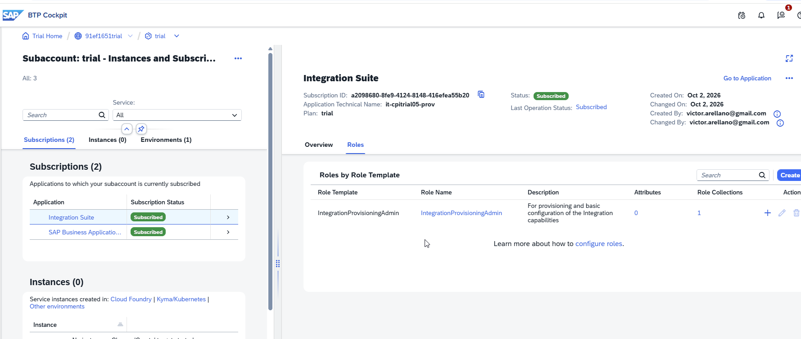
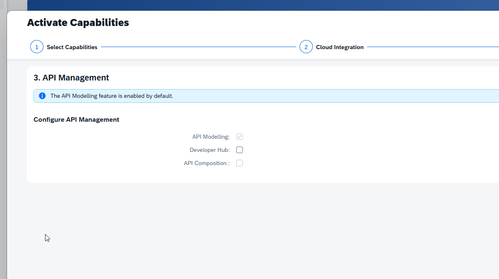
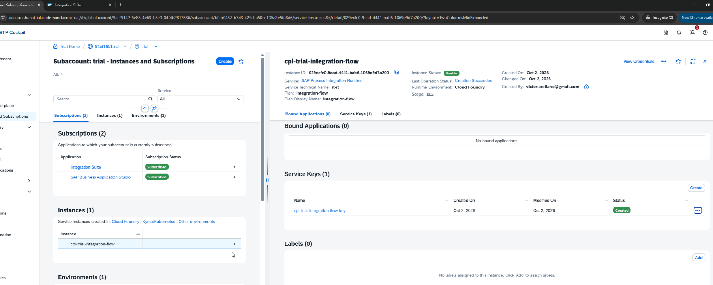

# 02 --- Habilitación de SAP Integration Suite y Cloud Integration

**Estado:** ✅ Completado

## Objetivo

Habilitar SAP Integration Suite, activar Cloud Integration y preparar
las autorizaciones y el runtime necesarios para diseñar y ejecutar
iFlows.

## Conceptos revisados

Se trabajó con subscriptions, role collections, capabilities de
Integration Suite y Process Integration Runtime. También se distinguió
entre la suscripción de Integration Suite y el servicio de runtime
utilizado para acceder a endpoints de integración.

## Laboratorio realizado

1.  Suscripción a **SAP Integration Suite**.
2.  Resolución del acceso inicial mediante Role Collections.
3.  Asignación de roles para administración, desarrollo y lectura.
4.  Activación de **Build Integration Scenarios / Cloud Integration**.
5.  Verificación de las capabilities habilitadas.
6.  Creación de una instancia **Process Integration Runtime**, plan
    `integration-flow`.
7.  Configuración del cliente con `Client Credentials`.
8.  Asignación de los roles `ESBMessaging.send` y `API.invoke`.
9.  Creación de Service Key para obtener las credenciales OAuth.
10. Verificación de que la instancia quedó `Usable`.

## Evidencia

### Suscripción de Integration Suite

### Role Collections

### Activación de capabilities

### Process Integration Runtime

### Instancia de runtime operativa

## Modelo conceptual

La suscripción a Integration Suite habilita el acceso a las capacidades
de integración. Cloud Integration proporciona el diseñador y runtime de
iFlows. Process Integration Runtime, mediante el plan
`integration-flow`, permite crear un cliente OAuth para invocar
endpoints protegidos.

Los roles del cliente no son un *realm*. En el laboratorio se utilizaron
como autorizaciones del cliente; `ESBMessaging.send` es el permiso
relevante para invocar el endpoint HTTPS protegido del iFlow.

## Seguridad

La Service Key contiene información sensible. El `client_secret` no debe
quedar almacenado en documentación ni Git. Durante el laboratorio una
credencial quedó visible accidentalmente y fue rotada; las capturas
sensibles fueron excluidas de esta documentación.

## Resultado validado

Integration Suite quedó accesible, Cloud Integration habilitado y
Process Integration Runtime operativo con OAuth Client Credentials.

## Estado final

`✅ Completado` --- plataforma preparada para diseñar, desplegar e
invocar iFlows.
