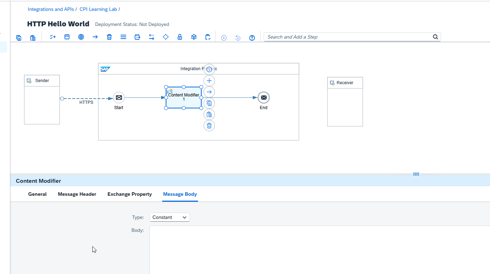
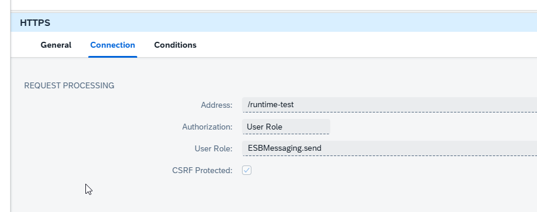
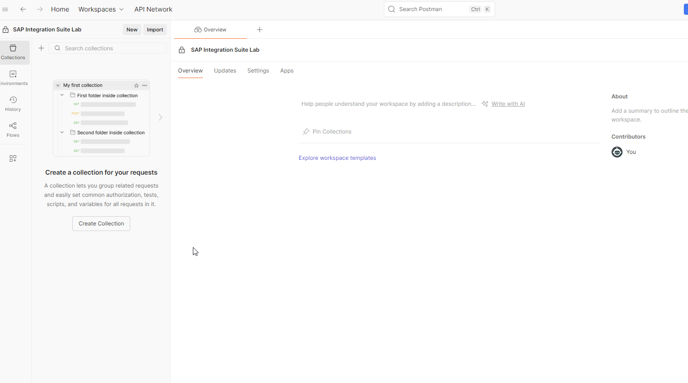
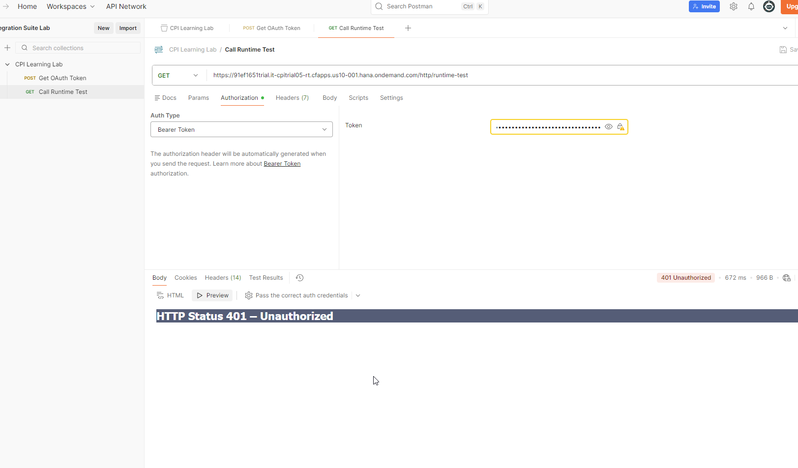

# 03 --- Primer iFlow HTTP con OAuth Client Credentials

**Estado:** ✅ Completado

## Objetivo

Construir y ejecutar un primer flujo completo en Cloud Integration:
recibir una petición HTTPS autenticada, procesarla en un iFlow y
devolver una respuesta JSON.

## Flujo implementado

El artefacto utilizado finalmente fue `Runtime Test`.

``` text
Postman
   |
   | OAuth 2.0 Client Credentials
   v
Servidor de autorización
   |
   | access_token
   v
HTTPS Sender /runtime-test
   |
   | ESBMessaging.send
   v
Content Modifier
   |
   v
Respuesta JSON
```

## Diseño del iFlow

El sender HTTPS se configuró con:

``` text
Address:       /runtime-test
Authorization: User Role
User Role:     ESBMessaging.send
CSRF Protected: habilitado
```

El Content Modifier construyó la respuesta:

``` json
{
  "message": "Hello World from SAP Cloud Integration"
}
```

y estableció el header:

``` text
Content-Type: application/json
```

### Evidencia del diseñador



### Seguridad del HTTPS Sender



## OAuth Client Credentials

Se creó en Postman una petición `Get OAuth Token`:

``` text
POST {{token_url}}
Authorization: Basic {{client_id}} : {{client_secret}}
Content-Type: application/x-www-form-urlencoded

grant_type=client_credentials
```

El token devuelto incluyó el scope asociado a `ESBMessaging.send`,
confirmando que el cliente tenía la autorización requerida.



## Invocación del iFlow

Se creó `Call Runtime Test` utilizando el endpoint exacto publicado por
Cloud Integration y autenticación Bearer.



Para evitar copiar manualmente el token en cada prueba, la petición de
token incorporó un script Post-response:

``` javascript
pm.collectionVariables.set(
    "access_token",
    pm.response.json().access_token
);
```

y la petición del iFlow pasó a utilizar:

``` text
{{access_token}}
```


## Qué quedó demostrado

Las dos requests de Postman siguen siendo independientes en ejecución.
La relación entre ellas se construyó mediante una **variable compartida
de colección**. `Get OAuth Token` actualiza `{{access_token}}` y
`Call Runtime Test` consume ese valor.

El token es temporal; si expira, debe obtenerse uno nuevo. En este
laboratorio todavía se ejecuta explícitamente la petición de token antes
de llamar al iFlow cuando es necesario.

## Incidentes del laboratorio

Durante los primeros despliegues apareció `ErrorPersistingArtifact` y un
undeploy quedó temporalmente en `Stopping`. Un iFlow mínimo también
presentó inicialmente el mismo error y posteriormente pudo desplegarse
sin cambiar la arquitectura base, por lo que se registró como
comportamiento transitorio observado en Trial y no como una causa de
diseño confirmada.

La primera llamada desde Postman devolvió `401 Unauthorized`. Se
comprobó que el token contenía `ESBMessaging.send`, que el header
`Authorization: Bearer ...` llegaba correctamente y que el sender exigía
el mismo rol. Al obtener un token nuevo y reemplazar el anterior, la
llamada funcionó.

## Resultado validado

Se obtuvo una respuesta HTTP exitosa desde el endpoint desplegado y el
JSON generado por el Content Modifier.

## Estado final

`✅ Completado` --- primer flujo end-to-end autenticado y validado.
