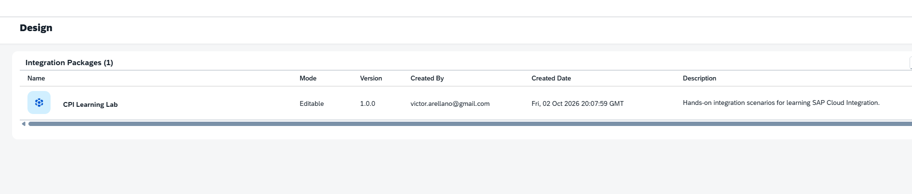
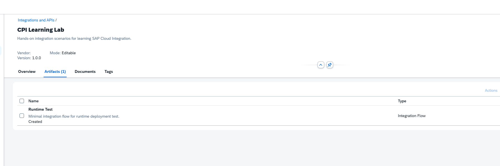
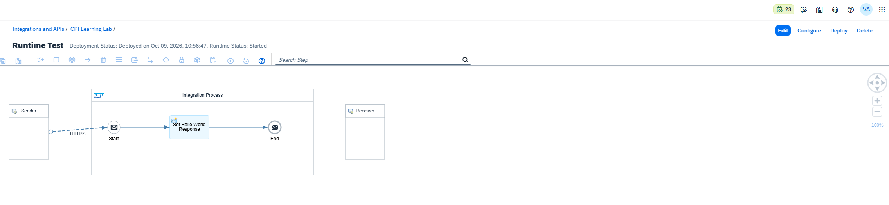
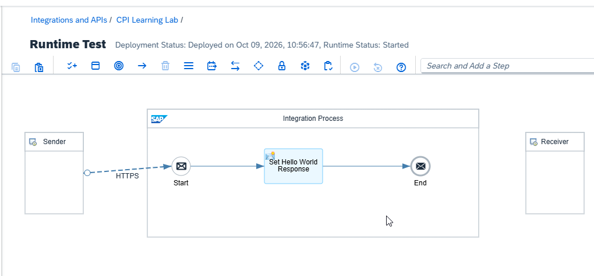
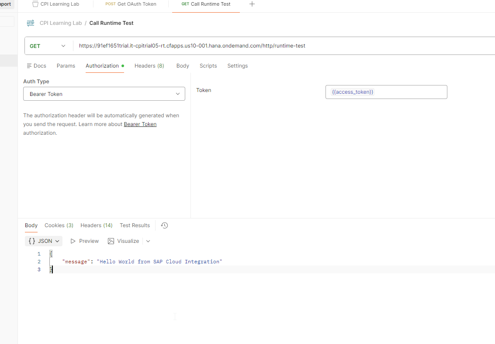
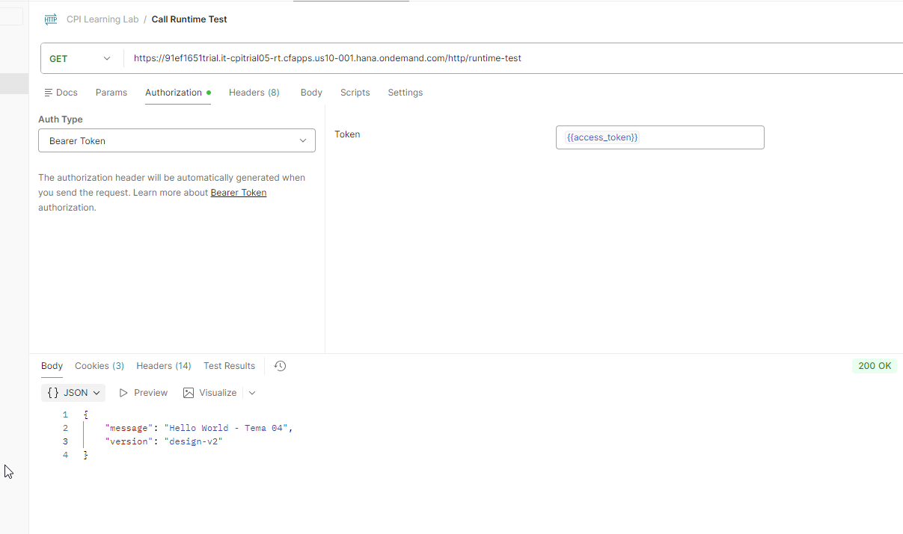
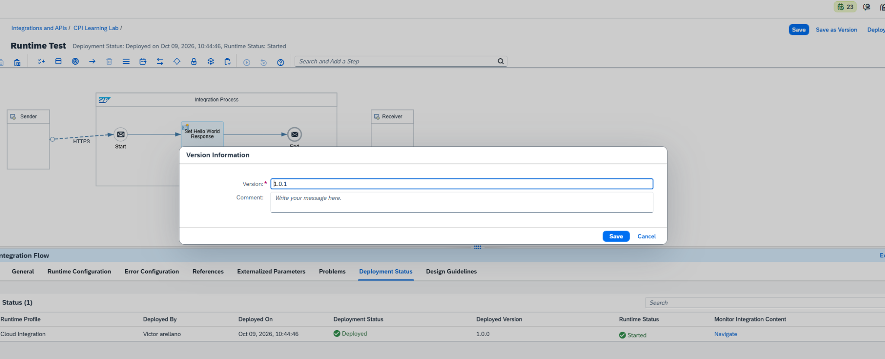
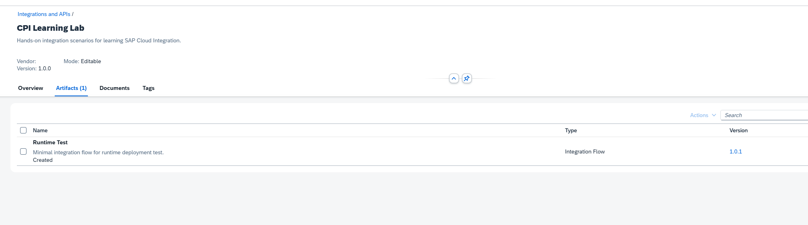
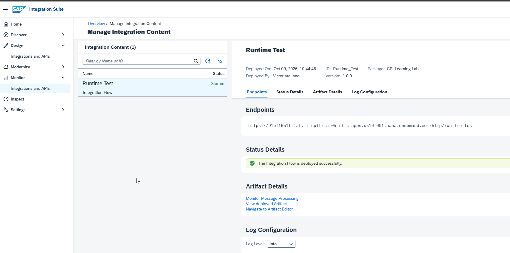
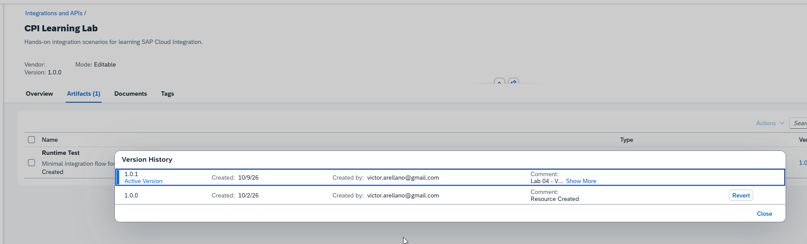

# 04 — Packages, artefactos y ciclo de vida de un iFlow

**Estado:** ✅ Completado
**Fecha de validación:** 2026-10-09
**Entorno:** SAP Integration Suite — Cloud Integration (Trial)

## Objetivo

Comprender la relación entre Integration Package, Integration Flow (iFlow), Design-time y Runtime, y verificar mediante un ejercicio real las diferencias entre guardar, desplegar y guardar una versión.

## Conceptos

- **Integration Package:** agrupador lógico de artefactos de integración. En este laboratorio: `CPI Learning Lab`, versión `1.0.0`, modo `Editable`.
- **Integration Flow:** artefacto que implementa la integración. En este laboratorio: `Runtime Test`.
- **Design-time:** entorno donde se edita y guarda la definición del iFlow.
- **Runtime:** entorno donde se ejecuta el artefacto desplegado.
- **Save:** guarda cambios en el diseño; no sustituye por sí solo la implementación en ejecución.
- **Deploy:** publica el artefacto en el runtime.
- **Save as Version:** registra una versión identificable del diseño, independientemente del despliegue.
- **Versiones diferentes:** la versión del package, la versión activa del diseño y la versión desplegada no son equivalentes.

## Prerrequisitos

- Temas 01–03 completados.
- Acceso a SAP Integration Suite / Cloud Integration, Design y Monitor.
- Package `CPI Learning Lab` con iFlow HTTP `Runtime Test`.
- Cliente HTTP Postman y autenticación OAuth ya configurados. **No almacenar tokens ni secretos en el repositorio.**

## Laboratorio paso a paso

### 04.1 — Identificar package y artefacto

1. Abrir **Design → Integrations and APIs**.
2. Localizar el package `CPI Learning Lab` y comprobar su versión `1.0.0` y modo `Editable`.
3. Abrir **Artifacts** y localizar el iFlow `Runtime Test` de tipo `Integration Flow`.
4. Abrir el iFlow y reconocer las acciones **Edit**, **Configure**, **Deploy** y **Delete**.

**Por qué:** separar la organización lógica (package) del artefacto que implementa el proceso (iFlow).

**Resultado observado:** package e iFlow identificados; iFlow inicialmente mostrado como `Draft`, con despliegue `Deployed` y runtime `Started`.

#### Evidencia 04.1 — Identificación del package y del iFlow

**1. Package identificado.** En Design se observa `CPI Learning Lab`, versión `1.0.0`, en modo `Editable`.



**2. Artefacto dentro del package.** La pestaña Artifacts muestra `Runtime Test` como `Integration Flow`, inicialmente en estado `Draft`.



**3. Acciones disponibles.** El menú contextual muestra `Copy`, `Git Pull`, `Git Push`, `View metadata`, `Download`, `Configure` y `Deploy`; en el editor también se observan `Edit` y `Delete`.



**4. Estado inicial del iFlow.** El editor muestra el proceso HTTP y los estados `Deployed` y `Started`, antes del experimento de modificación.



### 04.2 — Comprobar Design-time frente a Runtime

1. Abrir `Runtime Test` y seleccionar **Edit**.
2. Seleccionar el Content Modifier `Set Hello World Response` → **Message Body**. Su tipo es `Constant`.
3. Confirmar la respuesta inicial:

   ```json
   {"message":"Hello World from SAP Cloud Integration"}
   ```

4. Modificar el cuerpo por:

   ```json
   {
     "message": "Hello World - Tema 04",
     "version": "design-v2"
   }
   ```

5. Pulsar **Save**, **sin desplegar**. Ejecutar la misma petición HTTP desde Postman.
6. Comprobar que la respuesta seguía siendo el mensaje original.
7. Pulsar **Deploy**, esperar a que el runtime esté `Started` y repetir la petición.

**Por qué:** aislar el efecto de guardar del efecto de desplegar, manteniendo el mismo endpoint y la misma solicitud.

**Resultado observado:** después de Save, respuesta original; después de Deploy, Postman mostró `200 OK` y el JSON actualizado con `design-v2`.

#### Evidencia 04.2 — Antes y después del despliegue

**1. Antes de modificar: cuerpo original.** El Content Modifier `Set Hello World Response` utiliza `Type = Constant` y contiene el mensaje `Hello World from SAP Cloud Integration`.


**2. Antes del nuevo despliegue: respuesta original.** Después de guardar el cambio en Design sin desplegar, Postman continuó mostrando el mensaje anterior. Esto demuestra que el cambio guardado aún no estaba reflejado en la ejecución.



**3. Después del nuevo despliegue: respuesta actualizada.** Postman devolvió `200 OK`, el mensaje `Hello World - Tema 04` y el campo `version` con valor `design-v2`.



### 04.3 — Crear una versión sin redesplegar

1. En el editor del iFlow, seleccionar **Save as Version**.
2. Registrar la versión `1.0.1` y el comentario: `Lab 04 - Validated HTTP response change and design-time vs runtime deployment behavior.`
3. Guardar la versión **sin pulsar Deploy**.
4. Volver a **Design → CPI Learning Lab → Artifacts**: se observó `Runtime Test` versión `1.0.1`.
5. Abrir **Monitor → Integrations and APIs → Manage Integration Content**: se observó el artefacto `Runtime Test` `Started`, versión desplegada `1.0.0`.
6. Hacer clic en `1.0.1` desde la lista de artefactos y revisar **Version History**.

**Por qué:** comprobar que registrar una versión en Design no implica sustituir automáticamente la versión desplegada.

**Resultado observado:** el historial mostró `1.0.1` como **Active Version** (creada el 09/10/2026) y `1.0.0` como versión anterior (creada el 02/10/2026) con opción **Revert**. **No se ejecutó Revert.**

#### Evidencia 04.3 — Versión de diseño frente a versión desplegada

**1. Registro de nueva versión.** En `Save as Version` se propuso `1.0.1` para guardar una versión identificable del diseño, sin realizar otro despliegue.



**2. Después de guardar la versión: Design muestra 1.0.1.** En la pestaña Artifacts, `Runtime Test` aparece con la versión `1.0.1`.



**3. Sin redesplegar: Runtime conserva 1.0.0.** En Monitor, el iFlow continúa `Started` y la versión desplegada es `1.0.0`. Esto verifica que `Save as Version` no actualizó el runtime automáticamente.



**4. Historial de versiones.** `Version History` muestra `1.0.1` como `Active Version` y `1.0.0` como versión anterior, con la opción `Revert`. Esta opción no se ejecutó.



## Resultado esperado y validación

| Comprobación | Evidencia observada | Estado |
| --- | --- | --- |
| Package e iFlow identificados | `CPI Learning Lab` → `Runtime Test` | ✅ |
| Guardar sin desplegar | HTTP siguió respondiendo el cuerpo anterior | ✅ |
| Desplegar cambio | HTTP `200 OK` con cuerpo actualizado | ✅ |
| Versionar diseño | `1.0.1` en Artifacts | ✅ |
| Comparar con runtime | `1.0.0` desplegada, estado `Started` | ✅ |
| Revisar historial | `1.0.1` Active Version y `1.0.0` anterior | ✅ |
| Revertir versión | No ejecutado; fuera del alcance | ⬜ |

> **Precisión:** el campo JSON `"version":"design-v2"` es texto de negocio agregado en el Content Modifier; **no** corresponde a la versión administrada por SAP. La versión desplegada `1.0.0` ya contenía el nuevo JSON porque el despliegue se realizó antes de registrar `1.0.1`.

## Problemas encontrados

No se reportaron errores técnicos durante este laboratorio. La diferencia entre versión activa de diseño y versión desplegada es un **comportamiento esperado**, no un incidente.

## Aprendizajes

- Un package organiza artefactos, pero no es el motor de ejecución.
- **Save**, **Deploy** y **Save as Version** cumplen funciones distintas.
- Un iFlow puede mostrar `1.0.1` en Design mientras el runtime mantiene `1.0.0`.
- La versión desplegada no garantiza por sí sola qué cuerpo JSON contiene: para ello se comprueba la respuesta del endpoint.
- El historial ofrece trazabilidad de versiones. La operación **Revert** se observó, pero no se probó.

## Referencias

- [Repositorio SAP Integration Suite Learning Lab](https://github.com/victorarellano/sap-integration-suite-learning-lab)
- SAP Help Portal — SAP Cloud Integration: https://help.sap.com/docs/integration-suite/sap-integration-suite

## Estado final

**✅ Completado en la práctica** — laboratorios 04.1, 04.2 y 04.3 validados en la conversación el 09/10/2026.
